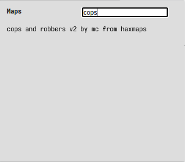

hmd
===
haxball maps are stored in the browser thanks to the built-in database
indexeddb but to download them you need to create a room, so I created this
little chrome extension that lets you download the maps without requiring
you to create a room

